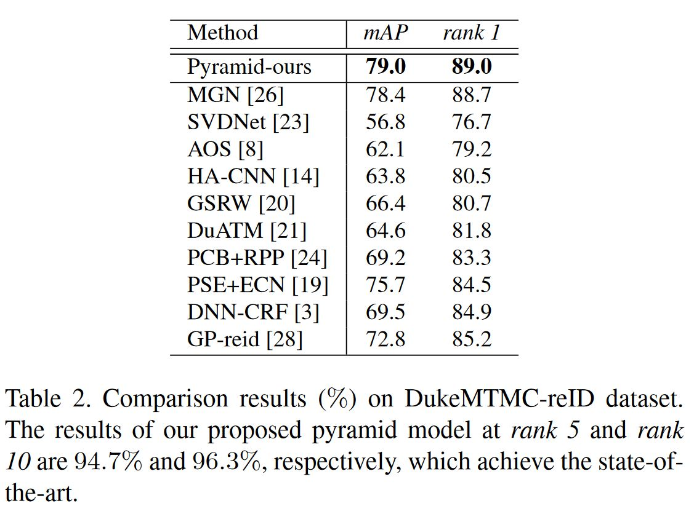

# Pyramidal Person Re-IDentification via Multi-Loss Dynamic Training (CVPR 2019)

Code for CVPR 2019 paper [Pyramidal Person Re-IDentification via Multi-Loss Dynamic Training](http://openaccess.thecvf.com/content_CVPR_2019/papers/Zheng_Pyramidal_Person_Re-IDentification_via_Multi-Loss_Dynamic_Training_CVPR_2019_paper.pdf). 

If you find this code useful in your research, please consider citing:
```
@inproceedings{zheng2019pyramidal,
  title={Pyramidal Person Re-IDentification via Multi-Loss Dynamic Training},
  author={Zheng, Feng and Deng, Cheng and Sun, Xing and Jiang, Xinyang and Guo, Xiaowei and Yu, Zongqiao and Huang, Feiyue and Ji, Rongrong},
  booktitle={Proceedings of the IEEE Conference on Computer Vision and Pattern Recognition},
  pages={8514--8522},
  year={2019}
}
```

## Requirements
scipy>=1.0.0
 
torch>=0.4.0
 
mock>=2.0.0
 
torchvision>=0.2.1

numpy>=1.14.0

Pillow>=5.0.0

scikit_learn>=0.18

## Training
1. Download the public datasets (only CUHK03, market1501 and DukeMTMC are implemented) and use the corresponding dataloader. To use your own dataset re-implement the dataloader in directory "src/datasets".

2. Sample running command under the same directory of this readme file:
    python src/train.py --root \<dataset directory\> --data_loader \<Name of the dataloader module\>

## Model Framework


## Model Performance



